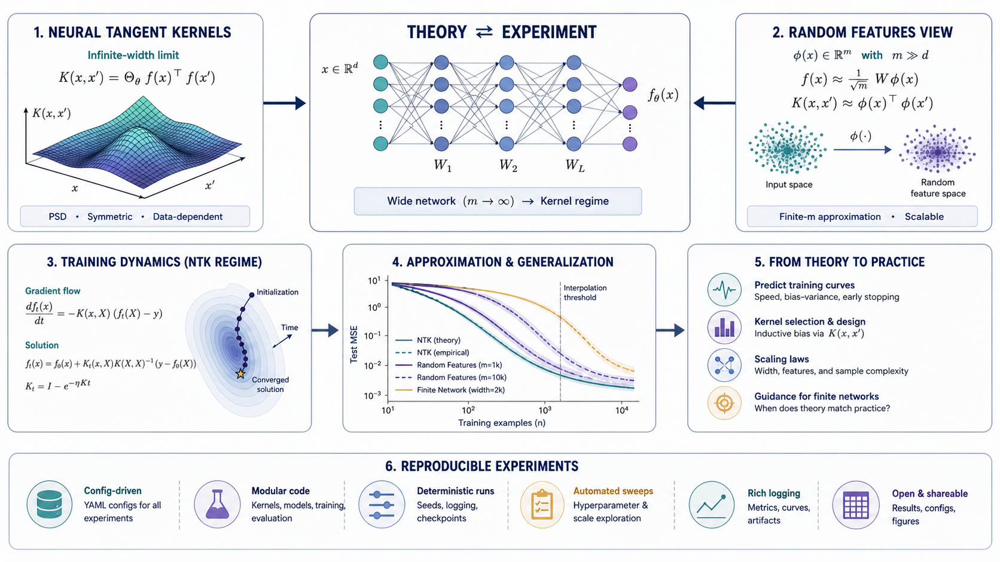

# Neural Network Theory Experiments

    

  <strong>Notebook-driven experiments for approximation, random features, and training dynamics.</strong>

  

The overview figure presents the project as a theory-to-experiment loop: derive the model view, run controlled notebooks, measure approximation quality, and collect figures for comparison.

## Overview

Neural Network Theory Experiments is a notebook workspace for studying links between projection pursuit, neural-network regression, random features, and empirical training behavior. The folders keep logs, results, and figure-producing notebooks close to the analysis.

## What Is Included

- `ppr&nnr.ipynb` and variants: main notebooks for projection-pursuit and neural-network regression experiments.
- `result/`, `result1/`: saved outputs from experiment runs.
- `log/`: execution logs and intermediate notes.
- `ppr&nnr figure*` notebooks: figure-generation notebooks for report plots.

## Quick Start

1. `git clone git@github.com:Hik289/nn-theory.git`
2. `python -m venv .venv && source .venv/bin/activate`
3. `python -m pip install -U pip jupyter numpy scipy matplotlib scikit-learn`
4. Open the main notebook first, then use the figure notebooks to regenerate plots.

## Suggested Workflow

1. Start with the smallest runnable script or notebook listed above.
2. Keep raw data paths and credentials outside the repository.
3. Save generated figures, tables, and reports under the existing result folders.
4. When an experiment becomes stable, record the exact data window, parameters, and command used to reproduce it.

## Repository Map

- `assets/readme-figure.png`: README overview figure.
- Project scripts and notebooks: core research entry points.
- Result or report folders: generated artifacts used for analysis and review.

## Paper or Reference

No external paper link is currently attached to this project. For now, the code, notebooks, and notes in this repository are the primary reference artifact.

## License

No explicit license file is included yet. Add one before public reuse, redistribution, or package release.

## Maintenance Notes

- Add a pinned environment file if this project is prepared for external installation.
- Keep large datasets outside Git and document where each script expects them locally.
- Prefer small, named experiment outputs over overwriting shared result files.
